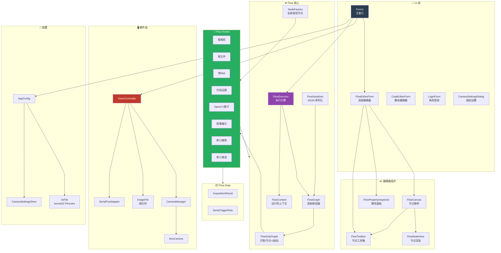
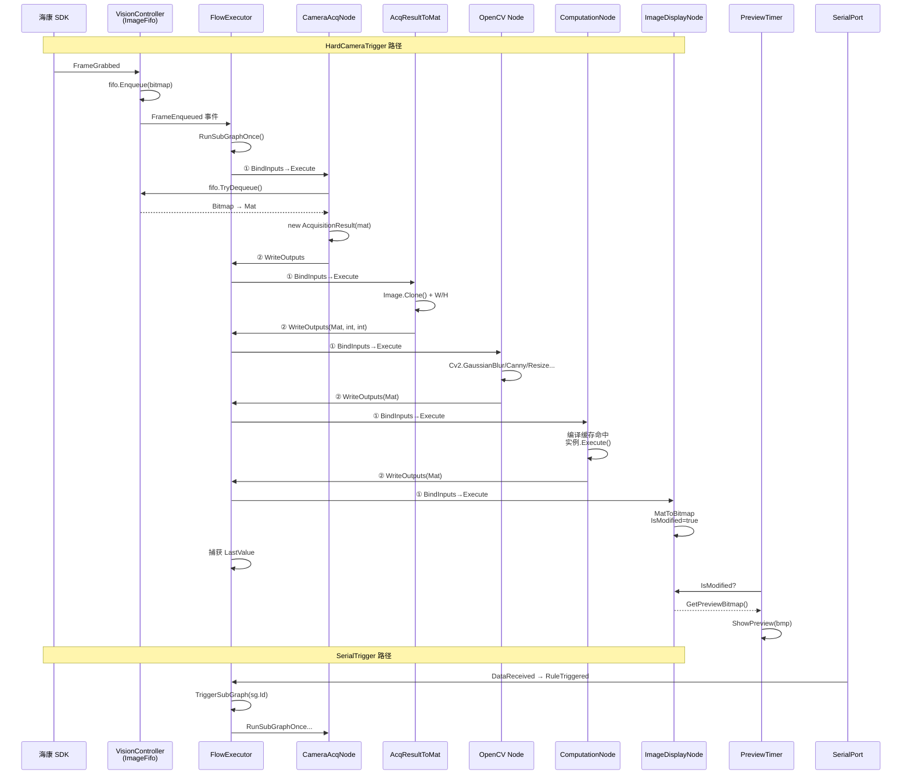
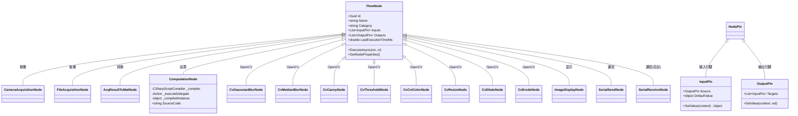
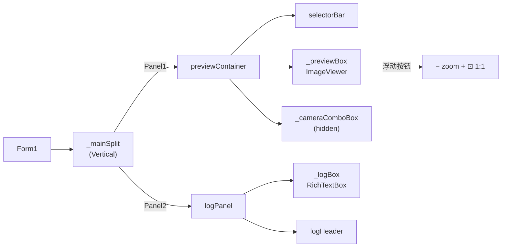
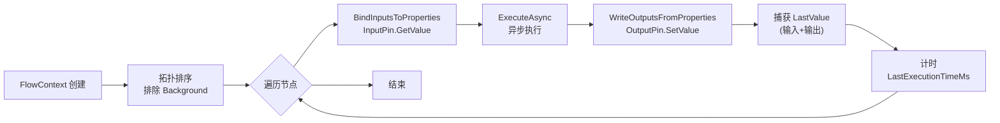
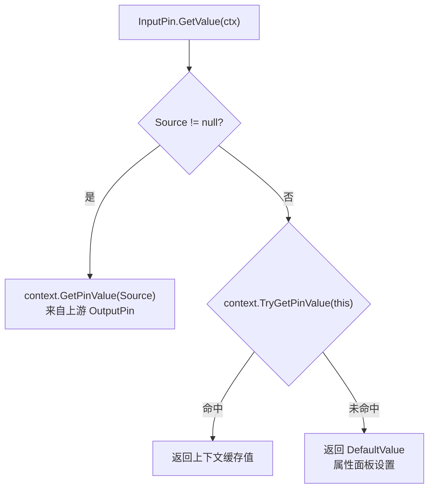

# VisualCutterForm

WinForms 视觉检测平台，支持海康工业相机、OpenCV 算子流程编排、C# 脚本运算节点、串口通信触发。

## 架构总览



## 数据/事件流



## 节点继承树



## 主窗口组件树



## RunSubGraphOnce 执行流程



## Pin 值解析链



## 技术栈

| 分类 | 技术 |
|------|------|
| 平台 | .NET Framework 4.8, WinForms |
| 图像 | OpenCvSharp4.Windows 4.8 |
| 相机 | MvCameraControl.Net (Hikrobot MVS SDK) |
| 脚本 | Microsoft.CodeAnalysis.CSharp 4.8 (Roslyn) |
| 序列化 | Newtonsoft.Json 13.0 |
| 串口 | System.IO.Ports 8.0 |
| 编辑器 | FastColoredTextBox 2.16 (FCTB) |
| 配置 | kernel32.dll P/Invoke INI 文件 |
| 构建 | MSBuild / VS 2022 Insiders (`.slnx`) |

## 节点清单

| 分类 | 节点 | 输入 | 输出 |
|------|------|------|------|
| 取像 | 相机取像 | — | AcquisitionResult |
| 取像 | 文件取像 | — | AcquisitionResult |
| 转换 | 取像结果转Mat | AcquisitionResult | Mat + Width + Height |
| OpenCV | 高斯模糊 | Mat | Mat |
| OpenCV | 中值模糊 | Mat | Mat |
| OpenCV | 边缘检测 | Mat | Mat |
| OpenCV | 阈值二值化 | Mat | Mat |
| OpenCV | 颜色转换 | Mat | Mat |
| OpenCV | 图像缩放 | Mat | Mat |
| OpenCV | 膨胀 | Mat | Mat |
| OpenCV | 腐蚀 | Mat | Mat |
| 运算 | 代码运算 | 动态引脚 | 动态引脚 |
| 显示 | 图像展示 | Mat | — |
| 通信 | 串口发送 | 待发数据 | — |
| 通信 | 串口接收(后台) | — | 接收数据 |

## 构建与运行

```powershell
# 启动 VS Developer Command Prompt
& "C:\Program Files\Microsoft Visual Studio\18\Insiders\Common7\Tools\Launch-VsDevShell.ps1"

# 构建
msbuild VisualCutterForm.slnx /p:Configuration=Debug

# 运行
VisualCutterForm\bin\Debug\VisualCutterForm.exe
```

## 约束

- `.csproj` 使用显式 `<Compile Include="...">` 条目，新增 `.cs` 文件需手动添加到项目文件
- `Form1.Designer.cs` 和 `Properties/` 下自动生成文件不可手改
- `NodeFactory` 通过反射自动发现 `FlowNode` 子类，无需手动注册节点
- Git 仓库: `git@github.com:AyalaKaguya/VisualCutterForm.git`
