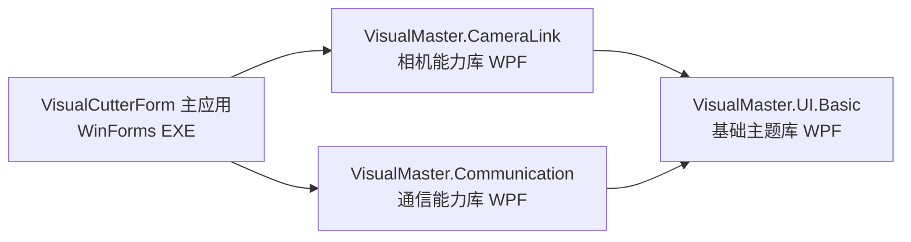
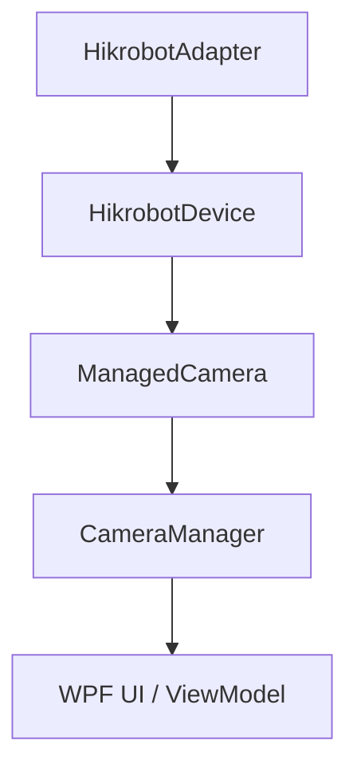
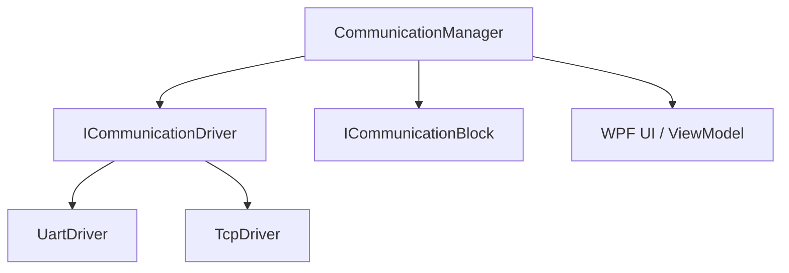

# VisualMaster

VisualMaster 是本仓库中的核心能力层，负责工业相机接入与通信驱动能力。

## VisualCutterForm 简介（保留）

VisualCutterForm 是上层业务应用（WinForms 可执行程序），用于把流程编排、界面交互和运行时控制整合为可交付的视觉检测软件。

## VisualCutterForm 与 VisualMaster 的关系

- `VisualCutterForm` 是解决方案名称与主应用工程（可执行程序）。
- `VisualMaster.*` 是能力组件库命名空间与工程前缀，不代表整个解决方案。
- 依赖方向是单向的：主应用依赖组件库，组件库不依赖主应用。



## 解决方案结构（按 VisualMaster 视角）

| 类型 | 工程 | 说明 |
|---|---|---|
| 主应用 | `VisualCutterForm/VisualCutterForm.csproj` | 应用壳层、流程执行、WinForms 编辑器与运行时桥接 |
| 基础库 | `VisualMaster.UI.Basic/VisualMaster.UI.Basic.csproj` | 统一深色主题 XAML（VMColor\* token + 命名样式），两个核心库共同依赖 |
| 核心库 | `VisualMaster.CameraLink/VisualMaster.CameraLink.csproj` | 相机设备发现、连接、采集、预览、配置 |
| 核心库 | `VisualMaster.Communication/VisualMaster.Communication.csproj` | UART/TCP 驱动抽象、数据块、输入输出事件、监控 |
| 示例应用 | `VisualMaster.CameraLink.App/VisualMaster.CameraLink.TestApp.csproj` | CameraLink 示例应用 |
| 示例应用 | `VisualMaster.CameraLink.TestApp/VisualMaster.CameraLink.TestApp.Viewer.csproj` | CameraLink Viewer 示例 |
| 示例应用 | `VisualMaster.Communication.TestApp/VisualMaster.Communication.TestApp.csproj` | Communication 示例应用 |
| 安装项目 | `SetupVisualCutter/SetupVisualCutter.vdproj` | 安装包工程 |

## VisualMaster.CameraLink

### 目标

提供海康相机设备接入能力，统一设备配置模型与帧缓冲模型，并暴露可复用 UI。

### 关键目录

- `VisualMaster.CameraLink/API/`
- `VisualMaster.CameraLink/Adapter/`
- `VisualMaster.CameraLink/Core/`
- `VisualMaster.CameraLink/UI/`

### 核心路径



### 关键事实

- 同时保留两条访问路径：
  - 兼容路径：`MvsCamera`（legacy）
  - 新路径：`HikrobotDevice -> ManagedCamera -> CameraManager`
- 推荐使用 `CameraDeviceConfig` / `CameraDeviceStatus` 与 device 模型。
- 帧对象通过 `CameraFrameBuffer` / `CameraFrameSnapshot` 管理，`Snapshot` 需要及时释放。

## VisualMaster.Communication

### 目标

提供可扩展的通信驱动框架，统一输入输出规则与字节块读写机制。

### 关键目录

- `VisualMaster.Communication/Api/`
- `VisualMaster.Communication/Core/`
- `VisualMaster.Communication/Driver/`
- `VisualMaster.Communication/UI/`

### 核心路径



### 关键事实

- 当前驱动实现包含 UART 与 TCP。
- 驱动通过工厂注册到 `CommunicationManager`。
- `SerialPortAdapter.cs` 文件存在于仓库中，但未纳入 `VisualMaster.Communication.csproj` 编译清单。

## 主应用如何接入 VisualMaster

- `VisualCutterForm/Forms/VisionController.cs`：主应用运行时编排入口。
- `VisualCutterForm/Forms/VisionCameraRuntime.cs`：相机运行时桥接。
- `VisualCutterForm/Forms/VisionSerialRuntime.cs`：通信运行时桥接。
- `VisualCutterForm/WorkFlow/FlowExecutor.cs`：流程执行器，通过服务接口调用硬件能力。

## 构建与运行

```powershell
# 在 VS Developer PowerShell 中执行
msbuild VisualCutterForm.slnx /p:Configuration=Debug

# 运行主程序
VisualCutterForm\bin\Debug\VisualCutterForm.exe
```

如果构建出现 `MSB3021` 文件占用，先关闭正在运行的 `VisualCutterForm.exe`。

## 开发约束

- 主要工程使用 old-style csproj，新增 `.cs` 文件后必须手动加入 `<Compile Include="...">`。
- WinForms/WPF 的 `Designer` 与自动生成资源文件不要手工编辑。
- 主应用触发系统使用 `TriggerEntry`（`Manual/CameraFrame/Timer/SerialMatch`），不再使用旧触发模型。
